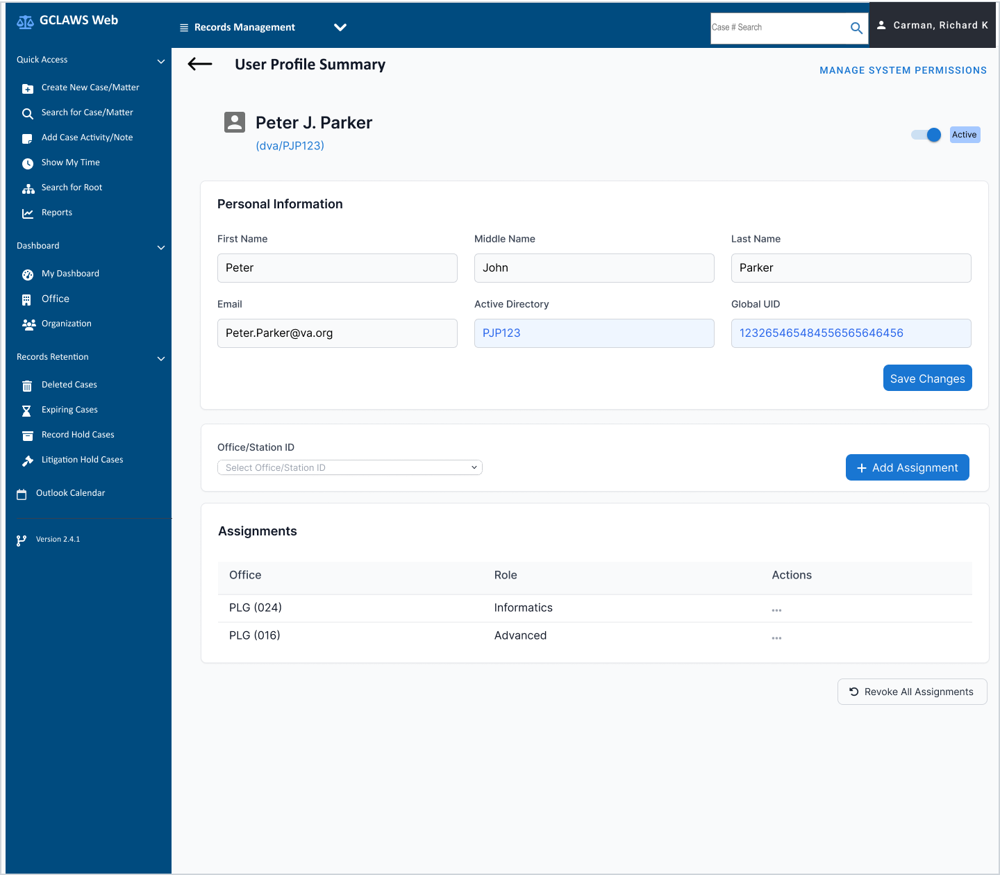

# VA / GCLAWS — Federal UX Modernization

**Role:** UX Designer · Adaptivestack Technologies  
**Timeline:** 2024 – Present  
**Context:** Government contractor supporting VA federal case management modernization  
**Tools:** Figma, Zeplin, USWDS, Section 508, WCAG 2.1 AA, HTML5/CSS3

---

## Overview

GCLAWS (Government Case and Legal Administration Web System) is a federal case management platform used by VA attorneys and legal staff to manage litigation, records retention, and case activity across regional offices nationwide.

I joined as the first dedicated UX resource on the engagement, responsible for bringing design system coherence, accessibility compliance, and research-driven iteration to a fragmented legacy product.

---

## The Problem

The platform had accumulated **40+ UI inconsistencies** across modules — mismatched components, non-compliant patterns, and no shared design language. Accessibility issues were routinely discovered late in QA, creating costly rework cycles. There was no structured user research process and no design-to-development handoff standard.

---

## My Process

### 1. UI Audit
Catalogued 40+ inconsistencies across navigation, forms, tables, modals, and filters. Prioritized by frequency and Section 508 risk, creating a remediation backlog tied directly to sprint planning.

### 2. Design System Build
Built a USWDS-aligned component library in Figma from scratch — buttons, filters, data tables, chips, modals, alerts, and navigation patterns — all with accessibility annotations baked in at the component level.

### 3. Accessibility Compliance
Enforced Section 508 and WCAG 2.1 AA at the design stage: color contrast checks, focus order documentation, screen reader labels, and keyboard navigation flows embedded in every spec before handoff.

### 4. User Research
Ran 20+ moderated usability sessions per quarter with VA legal staff — attorneys, paralegals, and office administrators. Sessions fed directly into sprint priorities rather than existing as a separate research track.

### 5. Developer Handoff
Authored HTML5/CSS3-annotated Zeplin specs with interaction states, accessibility notes, and responsive behavior documented per component. Reduced QA back-and-forth by ~40%.

---

## Featured Screen: RBAC Account Management

> Role-Based Access Control interface for managing user permissions across VA regional offices.

**Design decisions shown:**
- Filter chip system allows multi-attribute filtering (role, office, status) with one-click removal — reduces cognitive load for admin tasks performed under time pressure
- Search + filter bar consolidated into single toolbar rather than separate panels — reduces clicks for the most common admin workflow
- Sortable column headers with persistent sort indicators — supports legal staff who need to quickly audit user access by date or office
- Status badges (Active/Inactive) use color + text — not color alone — to meet WCAG 1.4.1 non-text contrast
- Overflow menus (⋮) keep the table scannable by hiding secondary actions until needed

---

## Outcomes

| Metric | Result |
|---|---|
| Accessibility defects shipped | **Zero** post design-system adoption |
| QA discrepancies | **~40% reduction** in design/build divergence |
| Design system adoption | **Org-wide** — all active modules |
| Usability sessions per quarter | **20+** moderated sessions with VA legal staff |
| Research integration | Findings fed directly into sprint backlog |

---

## What I Learned

Federal UX operates under constraints that consumer product work doesn't prepare you for — procurement cycles, compliance requirements, multi-stakeholder sign-off, and users who cannot be retrained easily. The wins come from building trust with developers early, making accessibility non-negotiable at the design stage (not QA), and connecting every design decision back to a documented user need.

---

## Related

- [Live Portfolio](https://richardcarman.github.io) — full case study with process walkthrough
- [GitHub Profile](https://github.com/richardcarman)
